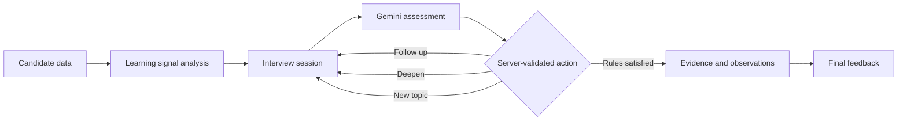
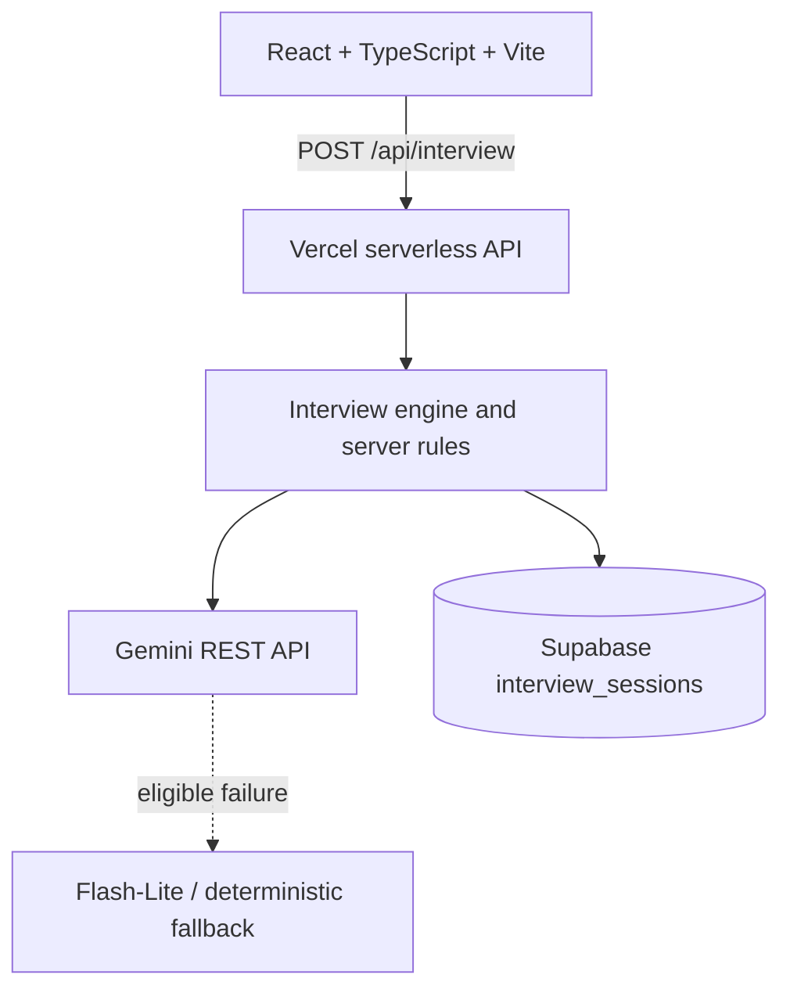

# Interview Agent

**Adaptive Interviews. Real Learning. Proven Growth.**

A personalized AI technical interviewer built for the ViCODATHON challenge. It combines a candidate's 31-day AI engineering learning journey with live adaptive questioning and evidence-backed feedback.


[Live Demo](https://ai-agent-blond-one.vercel.app) · [AI Usage Log](PROMPTS.md) · [Repository](https://github.com/chait4499/AI_AGENT)

> Learning history tells us where to look.
>
> The interview tells us what they know now.

Interview Agent is not a fixed-question chatbot. It analyzes historical learning signals, selects relevant curriculum areas, evaluates each live response, follows up when understanding is incomplete, deepens after strong answers, moves across topics, and produces feedback grounded in interview evidence.

## The Challenge

This project was created for the ViCODATHON Interview Agent challenge. The goal is to use a candidate's 31-day AI learning journey to conduct a realistic, contextual, multi-turn technical interview that adapts to answers, covers multiple curriculum areas, and ends with structured, actionable feedback.

This repository is an independent challenge submission and does not represent ViCODATHON or ABTalks.

## Key Features

### Learning-Aware Personalization

Candidate mission history is classified into meaningful signals:

- first-try strengths: passed in exactly one attempt;
- high-attempt topics: passed after three or more attempts;
- failed areas: recorded but not passed; and
- explicit skips: marked separately from all other outcomes.

Unlisted curriculum days are treated as having no recorded mission—not as failures.

### Adaptive Interviewing

Gemini assesses each answer as `weak`, `partial`, `good`, or `strong`. Its structured decision can request a focused follow-up, move to a new curriculum topic, or finish once the server's completion rules have been met.

### Dynamic Difficulty

Questions can progress through foundational, standard, advanced, and deep levels. Candidate role and experience help shape the selected topics, while live answers can lead to deeper design questions involving architecture, trade-offs, reliability, scalability, and production scenarios.

### Why This Question?

The interface gives a concise, structured reason for the current question without exposing hidden chain-of-thought. It can explain that the interview is validating a historical strength, probing a difficult topic, following up on a missing concept, or increasing depth after a strong answer.

### Interview Path

The visible path shows how the interview evolves: `VALIDATE`, `PROBE`, `FOLLOW-UP`, `DEEPEN`, and `NEW TOPIC`.

### Learning Signal Validation

Historical learning data is compared with current interview performance:

| Historical signal | Live signal | Result |
| --- | --- | --- |
| Difficulty | Good or strong | Improvement Validated |
| First-try strength | Good or strong | Strength Confirmed |
| Any history | Weak or partial | Needs Reinforcement |

### Evidence-Linked Feedback

When the match is reliable, a reported strength or gap links back to the relevant question number, curriculum day, topic, and a short excerpt from the candidate's answer.

### Reliable AI Fallback

The runtime reliability chain is:

`Gemini primary model` → `bounded retry` → `Gemini Flash-Lite fallback when eligible` → `deterministic curriculum fallback`

The fallback model is attempted only after eligible primary-model failures; it is not invoked on every request.

### Light and Dark Themes

The interface supports light and dark themes, follows the system preference on first visit, and persists an explicit user preference in browser storage.

## Interview Rules

The server—not the model—controls the interview boundaries:

- at least 8 curriculum-grounded questions;
- at least 4 unique curriculum days;
- questions mapped to organizer-provided curriculum objectives;
- no more than 3 consecutive questions on one day before forced progression; and
- structured final feedback with a summary, strengths, gaps, and next steps.

Gemini cannot bypass these completion and progression rules. The engine also caps an interview at 12 questions once the minimum coverage rules are satisfied.

## Curriculum Coverage

The application uses the organizer-provided curriculum without renaming or modifying its source data.

| Module | Days |
| --- | --- |
| Environment & Tooling | 1–3 |
| Data Foundations | 4–6 |
| Embeddings & Vector Search | 7–10 |
| LLM Core, Prompting & Fine-Tuning | 11–15 |
| Chatbot Application Build | 16–20 |
| Agentic AI & MCP | 21–24 |
| Evaluation, Security & Deployment | 25–28 |
| Production & Capstone | 29–31 |

## How It Works

1. Select a candidate.
2. Analyze their recorded learning history.
3. Choose relevant curriculum topics.
4. Start a personalized interview.
5. Evaluate each submitted answer.
6. Follow up, deepen, or switch topic.
7. Persist the updated interview state.
8. Produce evidence-backed feedback.



## Architecture



| Layer | Implementation |
| --- | --- |
| Frontend | React 19, TypeScript, Vite, Tailwind CSS |
| Backend | Vercel serverless `POST /api/interview` |
| AI | Direct Gemini REST integration, JSON schema output, server-side validation, primary/fallback model strategy |
| Persistence | Supabase `interview_sessions` table with JSON session state |
| Deployment | Vercel |

## API Contract

The frontend and server communicate through one endpoint:

```http
POST /api/interview
Content-Type: application/json
```

Start an interview:

```json
{
  "sessionId": "abc-123",
  "candidate": {
    "member": {
      "id": "candidate-id",
      "name": "Candidate Name",
      "jobRole": "Software Engineer",
      "yearsExperience": 3,
      "education": "Computer Science",
      "status": "active"
    },
    "missions": [],
    "signals": {
      "commitDays": 0,
      "missionsCompleted": 0,
      "missionsFirstTry": 0
    }
  }
}
```

Continue an interview:

```json
{
  "sessionId": "abc-123",
  "message": "The candidate's answer"
}
```

A question response includes the reply plus public question and progress metadata:

```json
{
  "reply": "...",
  "done": false,
  "question": {
    "day": 10,
    "topic": "The Retrieval & Matching Engine",
    "difficulty": "Advanced"
  },
  "questionCount": 4,
  "coveredDays": [7, 10, 13]
}
```

The final response keeps the required public feedback shape:

```json
{
  "reply": "Interview completed.",
  "done": true,
  "feedback": {
    "summary": "...",
    "strengths": [],
    "gaps": [],
    "next": []
  }
}
```

Adaptive responses may additionally include a validated public `observation` containing the assessed day, quality, understood concepts, and missing concepts.

## Reliability & Failure Handling

- Gemini is asked for JSON-schema-constrained output, which is parsed and validated again by server code.
- Empty, malformed, or invalid AI output is rejected and never used as a turn decision.
- The primary model receives at most two attempts; rate-limit guidance from `Retry-After` or Gemini retry metadata is honored within a 10-second cap.
- Answer assessment uses a 12-second timeout per provider attempt; final feedback uses a larger 30-second timeout per attempt.
- Flash-Lite is tried once after eligible primary failures such as timeouts, request errors, rate limits, unavailable models, and server errors.
- Deterministic curriculum questions and evidence-aware fallback feedback keep the interview usable when AI output is unavailable.
- Supabase upserts the complete session state after initialization and every continuation.

## Security Notes

- `GEMINI_API_KEY` is read only by server-side code.
- `SUPABASE_SECRET_KEY` is read only by server-side code and is sent to Supabase through the server request's `apikey` header.
- `.env.local` is excluded from Git.
- Structured provider responses are validated before use.
- Raw provider errors are not returned to users; production API failures use bounded, generic messages.
- Secrets are intentionally excluded from `PROMPTS.md` and the public documentation.

## Running Locally

Prerequisites: a current Node.js installation, npm, a Supabase project, a Gemini API key, and the Vercel CLI (which `npx` can download when needed).

```bash
npm ci
```

Create `.env.local` with variable names like these—never commit real values:

```dotenv
SUPABASE_URL=your_supabase_project_url
SUPABASE_SECRET_KEY=your_server_secret
GEMINI_API_KEY=your_gemini_api_key
GEMINI_MODEL=gemini-3.5-flash
GEMINI_FALLBACK_MODEL=gemini-3.5-flash-lite
```

The first three variables are required for the full production-like flow. `GEMINI_MODEL` and `GEMINI_FALLBACK_MODEL` are optional overrides; the shown model names are the application defaults.

In the Supabase SQL editor, run [`supabase/interview_sessions.sql`](supabase/interview_sessions.sql) to create the session table. Then start the complete local application:

```bash
npx vercel dev
```

`npm run dev` starts only the Vite frontend. `npx vercel dev` serves both the frontend and the `/api/interview` serverless endpoint.

## Project Structure

```text
api/
  interview.ts              # Public serverless endpoint
server/
  gemini.ts                 # Gemini client, validation, retry and fallback
  interviewEngine.ts        # Selection, adaptation and completion rules
  sessionStore.ts           # Supabase persistence and local development store
src/
  components/               # Candidate, interview and feedback UI
  data.ts                   # Organizer-data derivations
  evidence.ts               # Interview path and evidence matching
  useInterviewFlow.ts       # Frontend API/session flow
data/raw/
  candidates_(1).json
  curriculum.json
supabase/
  interview_sessions.sql
PROMPTS.md                  # Chronological AI usage log
AI_USAGE_EVIDENCE.md        # Submission evidence guide
```

## Validation

```bash
npm run test:interview
npm run build
npx vercel build --prod
```

The interview test suite exercises initialization, continuation, adaptive follow-ups and depth, enforced completion rules, Gemini retries and fallbacks, Supabase persistence, evidence logic, final feedback, and the public API contract. The Vercel production-build command was also used successfully during the production module-resolution fix documented in [`PROMPTS.md`](PROMPTS.md).

## AI Usage & Build Transparency

This project used AI intentionally and documents the workflow openly:

- **Bolt** supported initial frontend scaffolding and the first product prototype. Prompts 01–02 in [`PROMPTS.md`](PROMPTS.md) are clearly labeled historical reconstructions because their exact early text was not preserved; they are not presented as verbatim transcripts.
- **ChatGPT** served as a planning, architecture, testing, and debugging partner for requirement interpretation, interview strategy, candidate-data review, Gemini planning, manual adaptive testing, Supabase and quota/fallback diagnosis, Vercel production debugging, and Codex prompt preparation. It did not directly edit repository files.
- **OpenAI Codex** was the coding agent used in VS Code for repository-level implementation, including candidate correctness, the API/session foundation, Supabase storage, Gemini adaptation, feedback reliability, fallback models, UI redesign, Evidence & Adaptation, themes, the landing page, and Vercel production fixes.
- **GitHub is not an AI tool.** It is the audit trail connecting an AI prompt to changed files, validation, and a commit.

[Full AI Usage Log](PROMPTS.md) · [Detailed AI Usage Evidence](AI_USAGE_EVIDENCE.md)

## Deployment

The live React frontend and serverless interview API run on Vercel. Supabase provides session persistence, and Gemini provides adaptive assessment and feedback.

**Live:** [ai-agent-blond-one.vercel.app](https://ai-agent-blond-one.vercel.app)

## Submission Links

- **Live Demo:** [https://ai-agent-blond-one.vercel.app](https://ai-agent-blond-one.vercel.app)
- **Source Code:** [https://github.com/chait4499/AI_AGENT](https://github.com/chait4499/AI_AGENT)
- **AI Usage Log:** [PROMPTS.md](https://github.com/chait4499/AI_AGENT/blob/main/PROMPTS.md)
- **Detailed AI Evidence:** [AI_USAGE_EVIDENCE.md](AI_USAGE_EVIDENCE.md)
